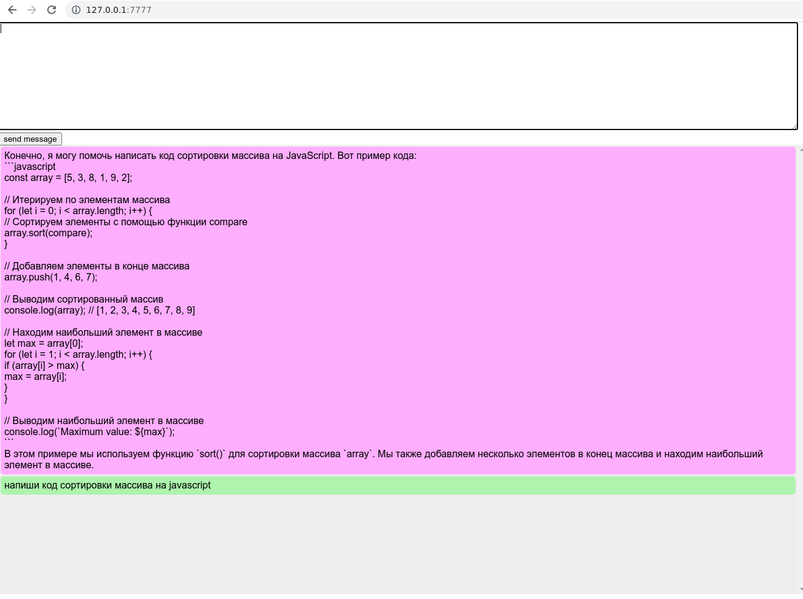

# wapp_fastchat_api_server

Сервер для работы с языковой моделью Vicuna.

## Запуск

```
./env.sh
./start_cli.sh
```

Заменить строчку в `main.py`

```python
model_name = "/home/hightemp/ForTesting/FastChat/vicuna_7b/"
```

## Модели

- Можно скачать Vicuna 13B: https://rentry.co/nur779
- Утилиты для ковертирования модели `convert_llama_weights_to_hf.py`: https://github.com/lm-sys/FastChat

## Пример запроса

```
POST /predict HTTP/1.1
Host: localhost:8000
Content-Type: application/json

{
    "text": "The quick brown fox jumps over the lazy dog."
}
```

```
HTTP/1.1 200 OK
content-type: application/json

{
    "result": [
        "The quick brown fox jumps over the lazy dog. The end."
    ]
}
```

## Скриншоты

